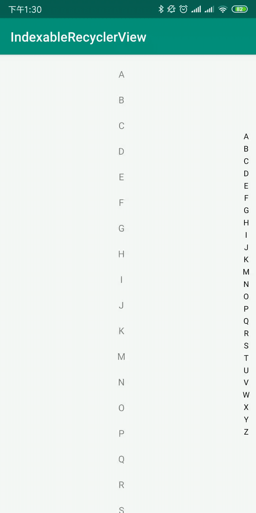

# IndexableRecyclerview
为Recycleview增加索引功能，只支持列表索引。
## 效果

## 用法

在布局文件中引入控件

```xml
<elvis.view.indexablerecyclerview.IndexableRecyclerView
        android:id="@+id/list"
        android:layout_width="match_parent"
        android:layout_height="match_parent"/>
```
支持的自定义属性

| 属性      | 单位      | 说明                      |
| --------- | --------- | ------------------------- |
| textColor | color     | 索引字体颜色              |
| textSize  | dimension | 索引字体大小，默认12sp    |
| padding   | dimension | 索引左右padding，默认10dp |
| gap       | dimension | 索引字母上下间隙，默认3dp |

下一步Adapter实现SectionIndexer接口，为索引提供数据和下标查询。

```java
class MyAdapter : RecyclerView.Adapter<ViewHolder>(), SectionIndexer {
        ...
        //索引字符串数组，可以为任意字符串
        override fun getSections(): Array<String> {
            return datas
        }
        //空实现即可
        override fun getSectionForPosition(position: Int): Int {
            return 0
        }
        //查找索引下标,sectionIndex为索引字符数组下标
        override fun getPositionForSection(sectionIndex: Int): Int {
            return sectionIndex
        }
    }
```

